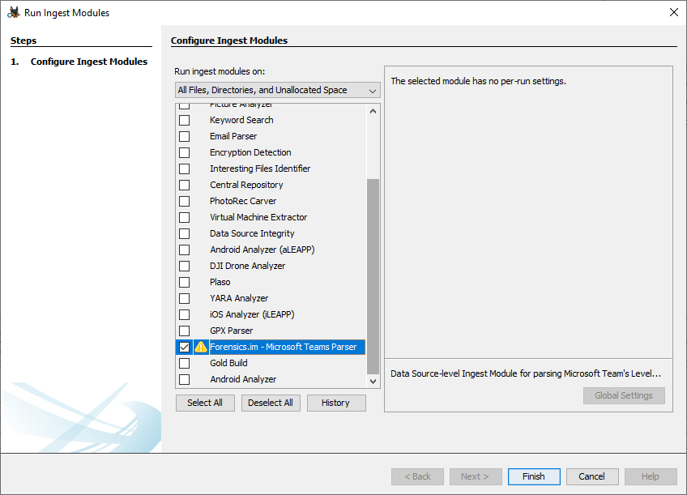

# Forensics.im Microsoft Teams Parser & Autopsy Plugin 🕵️‍♂️
[](https://github.com/lxndrblz/forensicsim/blob/main/LICENSE.md)
Forensics.im is an Autopsy Plugin, which allows parsing *levelDB* of modern Electron-based Instant Messenger Applications like Microsoft Teams. Unlike the existing [levelDB plugin](https://github.com/markmckinnon/Autopsy-Plugins/tree/master/Leveldb), Forensics.im also parses the binary *ldb* files, which contain the majority of the entries and allows identifies individual entities, such as messages and contacts, and presets these in Autopsy's blackboard view.

This plugin is an artefact of the Master Thesis *Digital Forensic Acquisition and Analysis of Artefacts Generated by Electron-based Communication Platforms* at the University of Abertay, Dundee, United Kingdom.



---
# Quickstart
## Standalone Parser Usage
The standalone parser script writes all the processed and identified records into a structured JSON file, which can either be processed by the Autopsy Plugin or in another application..
The main parser script can be used like this:
```bash
.\dist\ms_teams_parser.exe -f ".\testdata\John Doe\IndexedDB\https_teams.microsoft.com_0.indexeddb.leveldb" -o "C:\Temp\John Doe.json"
```
Feel free to use the LevelDB files provided in this repository.

The parser has the following options:
```text
 _____                        _            _
|  ___|__  _ __ ___ _ __  ___(_) ___ ___  (_)_ __ ___
| |_ / _ \| '__/ _ \ '_ \/ __| |/ __/ __| | | '_ ` _ \
|  _| (_) | | |  __/ | | \__ \ | (__\__ \_| | | | | | |
|_|  \___/|_|  \___|_| |_|___/_|\___|___(_)_|_| |_| |_|

__  ___                  _     _____           _
\ \/ / |_ _ __ __ _  ___| |_  |_   _|__   ___ | |
 \  /| __| '__/ _` |/ __| __|   | |/ _ \ / _ \| |
 /  \| |_| | | (_| | (__| |_    | | (_) | (_) | |
/_/\_\\__|_|  \__,_|\___|\__|   |_|\___/ \___/|_|


usage: ms_teams_parser.exe [-h] -f FILEPATH -o OUTPUTPATH

Forensics.im Xtract Tool

optional arguments:
  -h, --help            show this help message and exit

required arguments:
  -f FILEPATH, --filepath FILEPATH
                        File path to the IndexedDB.
  -o OUTPUTPATH, --outputpath OUTPUTPATH
                        File path to the processed output.
```
---
# Development
## Compiling the utils\main.py to an Executable which can be interfaced by the Autopsy Wrapper or used in a standalone mode:
```bash
pyinstaller "main.spec"
```

## Used Python Modules
This script uses the [ccl_chrome_indexeddb](https://github.com/cclgroupltd/ccl_chrome_indexeddb) Python module for enumerating the *LevelDB* artefacts without external dependencies.
---

# Utility Scripts for populating Microsoft Skype and Microsoft Teams
## populate_skype.py
A wee script for populating *Skype for Desktop* in a lab environment.
The script can be used like this:
```
utils\populate_skype.py -a 0 -f conversation.json
```
## populate_teams.py
A wee script for populating *Microsoft Teams* in a lab environment.
The script can be used like this:
```
utils\populate_teams.py -a 0 -f conversation.json
```
