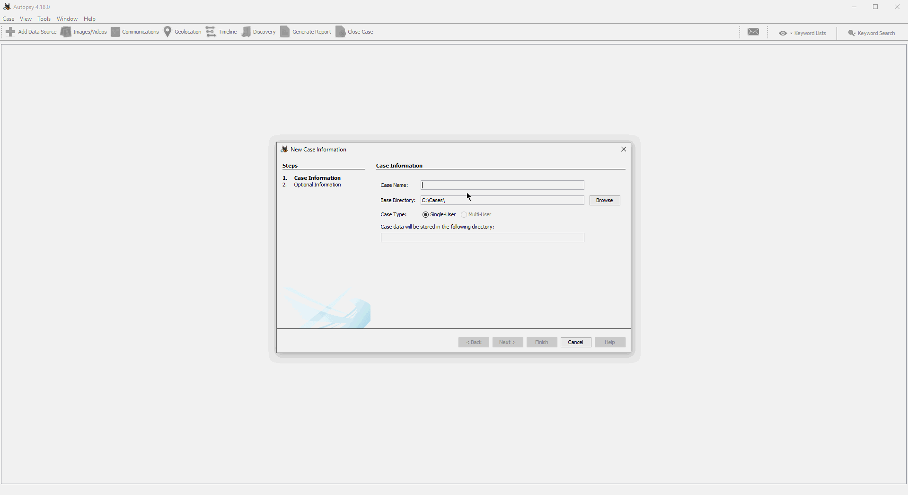

# Forensics.im Microsoft Teams Parser & Autopsy Plugin 🕵️‍♂️


Forensics.im is an Autopsy Plugin, which allows parsing *levelDB* of modern Electron-based Instant Messenger
Applications like Microsoft Teams. Unlike the
existing [levelDB plugin](https://github.com/markmckinnon/Autopsy-Plugins/tree/master/Leveldb), Forensics.im also parses
the binary *ldb* files, which contain the majority of the entries and allows identifies individual entities, such as
messages and contacts, and presets these in Autopsy's blackboard view.

This parser has been tested using:
* Microsoft Teams 1.4.00.11161 (Windows 10) with a free business organisation
* Microsoft "Teams 2.0" (Windows 11) 48/21062133356 with a personal organisation

This plugin is an artefact of the Master Thesis *Digital Forensic Acquisition and Analysis
of Artefacts Generated by Microsoft Teams* at the University of Abertay, Dundee, United Kingdom.

---

# Microsoft Teams From a Forensic Perspective
If you are curious about the artefacts that are generate by Microsoft Teams, I would like to refer you to my in-depth blog post on my [personal website](https://www.alexbilz.com/post/2021-09-09-forensic-artifacts-microsoft-teams/). It discusses in great details which file are created by Microsoft Teams and how these could be utilised in a forensic investigation.

# Demo



---

# Quickstart

## Autopsy Module Installation
This module requires the installation of Autopsy v4.18 or above and a *Windows*-based system.

To install the *Microsoft Teams* parser for *Autopsy*, please follow these steps:
* Download the `forensicsim.zip` folder of the latest available [release](https://github.com/lxndrblz/forensicsim/releases).
* Extract the `.zip` folder onto your computer.
* Open the Windows File Explorer and navigate to your *Autopsy* Python plugin directory. By default, it is located under `%AppData%\autopsy\python_modules`.
* Create a new `forensicsim` folder within the `python_modules` folder.
* Copy the `ms_teams_parser.exe` and the `Forensicsim_Parser.py` to the `forensicsim` directory.
* Restart *Autopsy* to activate the module.

You can test verify that the module has installed successfully by performing the following steps:
* Start Autopsy.
* Open/Create a case and add a source.
* You will find the added modules under the menu Tools-> Run Ingest Modules -> Name of the Data Source.

## Standalone Parser Usage

The standalone parser script writes all the processed and identified records into a structured JSON file, which can
either be processed by the Autopsy Plugin or in another application.

The main parser script can be used like this:

```bash
.\dist\ms_teams_parser.exe -f ".\forensicsim-data\john_doe_old_teams\IndexedDB\https_teams.microsoft.com_0.indexeddb.leveldb" -o "john_doe.json"
```

Feel free to use the LevelDB files provided in this repository.

The parser has the following options:

```text
 _____                        _            _
|  ___|__  _ __ ___ _ __  ___(_) ___ ___  (_)_ __ ___
| |_ / _ \| '__/ _ \ '_ \/ __| |/ __/ __| | | '_ ` _ \
|  _| (_) | | |  __/ | | \__ \ | (__\__ \_| | | | | | |
|_|  \___/|_|  \___|_| |_|___/_|\___|___(_)_|_| |_| |_|

__  ___                  _     _____           _
\ \/ / |_ _ __ __ _  ___| |_  |_   _|__   ___ | |
 \  /| __| '__/ _` |/ __| __|   | |/ _ \ / _ \| |
 /  \| |_| | | (_| | (__| |_    | | (_) | (_) | |
/_/\_\\__|_|  \__,_|\___|\__|   |_|\___/ \___/|_|


usage: ms_teams_parser.exe [-h] -f FILEPATH -o OUTPUTPATH

Forensics.im Xtract Tool

optional arguments:
  -h, --help            show this help message and exit

required arguments:
  -f FILEPATH, --filepath FILEPATH
                        File path to the IndexedDB.
  -o OUTPUTPATH, --outputpath OUTPUTPATH
                        File path to the processed output.
```

---

# Development

## Compiling the utils\main.py to an Executable:

```bash
pyinstaller "main.spec"
```

---

# Utility Scripts for handling LevelDB databases:

## dump_leveldb.py
This script allows dumping a *Microsoft Teams LevelDB* to a json file, without processing it further. The usage is
as following. Simply specify the path to the database and where you want to output the JSON file.
```text
 _____                        _            _
|  ___|__  _ __ ___ _ __  ___(_) ___ ___  (_)_ __ ___
| |_ / _ \| '__/ _ \ '_ \/ __| |/ __/ __| | | '_ ` _ \
|  _| (_) | | |  __/ | | \__ \ | (__\__ \_| | | | | | |
|_|  \___/|_|  \___|_| |_|___/_|\___|___(_)_|_| |_| |_|

 ____                          _____           _
|  _ \ _   _ _ __ ___  _ __   |_   _|__   ___ | |
| | | | | | | '_ ` _ \| '_ \    | |/ _ \ / _ \| |
| |_| | |_| | | | | | | |_) |   | | (_) | (_) | |
|____/ \__,_|_| |_| |_| .__/    |_|\___/ \___/|_|
                      |_|

usage: dump_leveldb.py [-h] -f FILEPATH -o OUTPUTPATH
dump_leveldb.py: error: the following arguments are required: -f/--filepath, -o/--outputpath
```
---

# Utility Scripts for populating Microsoft Skype and Microsoft Teams

## populate_skype.py

A wee script for populating *Skype for Desktop* in a lab environment. The script can be used like this:

```bash
tools\populate_skype.py -a 0 -f conversation.json
```

## populate_teams.py

A wee script for populating *Microsoft Teams* in a lab environment. The script can be used like this:

```bash
tools\populate_teams.py -a 0 -f conversation.json
```

---
# Datasets
This repository comes with two datasets that allow reproducing the findings of this work. The `testdata` folder contains the *LevelDB* databases that have been extracted from two test clients. These can be used for benchmarking without having to perform a (lengthy) data population.

The `populationdata` contains *JSON* files of the communication that has been populated into the testing environment. These can be used to reproduce the experiment from scratch. However, for a rerun, it will be essential to adjust the dates to future dates, as the populator script relies on sufficient breaks between the individual messages.
---

# Acknowledgements & Thanks

- [ccl_chrome_indexeddb](https://github.com/cclgroupltd/ccl_chrome_indexeddb) Python module for enumerating the *
  LevelDB* artefacts without external dependencies.
- [Gutenberg Project](https://www.gutenberg.org/files/1661/1661-0.txt) Part of Arthur Conan Doyle's book *The Adventures
  of Sherlock Holmes* have been used for creating a natural conversation between the two demo accounts.
